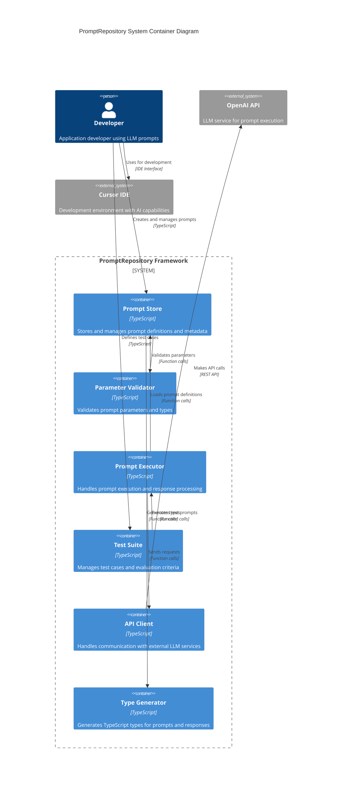

```mermaid
C4Container
title PromptRepository System Container Diagram

Person(developer, "Developer", "Application developer using LLM prompts")

System_Boundary(prompt_repo, "PromptRepository Framework") {
    Container(prompt_store, "Prompt Store", "TypeScript", "Stores and manages prompt definitions and metadata")
    Container(param_validator, "Parameter Validator", "TypeScript", "Validates prompt parameters and types")
    Container(prompt_executor, "Prompt Executor", "TypeScript", "Handles prompt execution and response processing")
    Container(test_suite, "Test Suite", "TypeScript", "Manages test cases and evaluation criteria")
    Container(api_client, "API Client", "TypeScript", "Handles communication with external LLM services")
    Container(type_generator, "Type Generator", "TypeScript", "Generates TypeScript types for prompts and responses")
}

System_Ext(openai_api, "OpenAI API", "LLM service for prompt execution")
System_Ext(cursor_ide, "Cursor IDE", "Development environment with AI capabilities")

Rel(developer, prompt_store, "Creates and manages prompts", "TypeScript")
Rel(developer, test_suite, "Defines test cases", "TypeScript")
Rel(prompt_store, param_validator, "Validates parameters", "Function calls")
Rel(prompt_executor, api_client, "Sends requests", "Function calls")
Rel(api_client, openai_api, "Makes API calls", "REST API")
Rel(test_suite, prompt_executor, "Executes test prompts", "Function calls")
Rel(prompt_store, type_generator, "Generates types", "Function calls")
Rel(developer, cursor_ide, "Uses for development", "IDE Interface")
Rel(prompt_executor, prompt_store, "Loads prompt definitions", "Function calls")
``` 