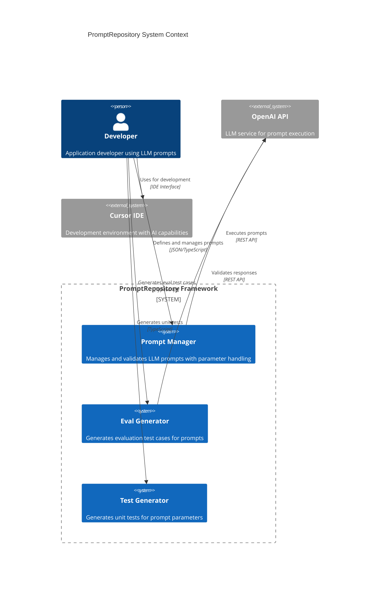

```mermaid
C4Context
title PromptRepository System Context

Person(developer, "Developer", "Application developer using LLM prompts")

System_Boundary(prompt_repo, "PromptRepository Framework") {
    System(prompt_manager, "Prompt Manager", "Manages and validates LLM prompts with parameter handling")
    System(eval_generator, "Eval Generator", "Generates evaluation test cases for prompts")
    System(test_generator, "Test Generator", "Generates unit tests for prompt parameters")
}

System_Ext(openai_api, "OpenAI API", "LLM service for prompt execution")
System_Ext(cursor_ide, "Cursor IDE", "Development environment with AI capabilities")

Rel(developer, prompt_manager, "Defines and manages prompts", "JSON/TypeScript")
Rel(developer, eval_generator, "Generates eval test cases", "TypeScript")
Rel(developer, test_generator, "Generates unit tests", "TypeScript")
Rel(prompt_manager, openai_api, "Executes prompts", "REST API")
Rel(eval_generator, openai_api, "Validates responses", "REST API")
Rel(developer, cursor_ide, "Uses for development", "IDE Interface")
``` 