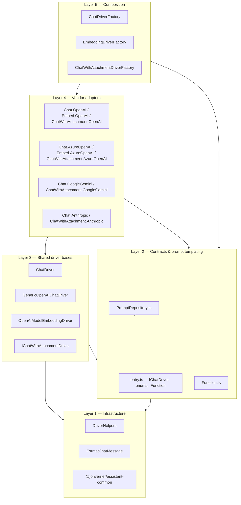

# PromptRepository — Package Design

This document describes how `@jonverrier/prompt-repository` is organised: the LLM driver abstractions, vendor adapters, factories, and dependency rules. It is the canonical design reference for this package.

For usage, installation, and prompt JSON format, see [`README.md`](README.md). For C4 diagrams, see [`src/README.StrongAI.Context.md`](src/README.StrongAI.Context.md) and [`src/README.StrongAI.Component.md`](src/README.StrongAI.Component.md). For agent-oriented notes, see [`AGENTS.md`](AGENTS.md).

---

## Purpose

PromptRepository is a **standalone library** for two related concerns:

1. **Prompt management** — load prompts from JSON or in-memory arrays, expand `{PLACEHOLDER}` templates, validate parameters.
2. **LLM access** — a **thin, provider-agnostic layer** over vendor APIs so callers can switch at runtime across **OpenAI**, **Azure OpenAI**, **Google Gemini**, and **Anthropic**.

Consumers (Assistant, C4-Auto, Ripstop, tests, and examples) depend on **interfaces and factories**, not on vendor SDKs directly. Peer dependencies (`openai`, `@google/generative-ai`, `@anthropic-ai/sdk`) are installed by the host application; only the drivers for the chosen provider need to be configured.

---

## Design principles

### Thin vendor layer

Each vendor adapter should be **small**: construct the SDK client, map `EModel` to a model or deployment name, and delegate behaviour to shared abstractions where possible. Business logic (tool loops, retries, message shaping for a given API) belongs in **shared bases**, not duplicated across four copies of the same loop.

The target shape:

```text
Application code
    → IChatDriver (interface)
        → ChatDriver (shared helpers)
            → GenericOpenAIChatDriver (OpenAI Responses API — shared by native + Azure)
                → OpenAIChatDriver          (~config only)
                → AzureOpenAIChatDriver     (~config only)
            → GoogleGeminiChatDriver        (full adapter today)
            → AnthropicChatDriver           (full adapter today)
```

OpenAI native and Azure OpenAI share **`GenericOpenAIChatDriver`** because both use the same `openai` npm package and the **Responses API** surface. Gemini and Anthropic implement **`ChatDriver`** directly against their SDKs.

### Concrete implementations depend only on abstractions

**Rule:** vendor modules (`Chat.OpenAI.ts`, `Chat.GoogleGemini.ts`, …) may import:

- **Contracts** — `entry.ts` interfaces and enums (`IChatDriver`, `EModel`, `IFunction`, …)
- **Shared bases** — `Chat.ts`, `Chat.GenericOpenAI.ts`, `Embed.ts`, `DriverHelpers.ts`
- **Their vendor SDK** — peer dependency

They must **not** import other vendor adapters (e.g. `Chat.Anthropic.ts` must not import `Chat.OpenAI.ts`).

**Factories** (`ChatFactory.ts`, `EmbedFactory.ts`, `ChatWithAttachmentFactory.ts`) are the only modules that import all vendor implementations and select one at runtime.

### Runtime provider switching

Switching providers is **explicit at driver construction time**:

```typescript
const driver = new ChatDriverFactory().create(EModel.kLarge, EModelProvider.kAzureOpenAI);
```

- **`EModel`** — logical size (`kLarge` / `kMini`); each adapter maps this to vendor-specific model or deployment names.
- **`EModelProvider`** — which vendor to use (`kOpenAI`, `kAzureOpenAI`, `kGoogleGemini`, `kAnthropic`, or `kDefault`).

There is no global singleton provider inside the library. **Applications choose the provider** (e.g. per personality, CLI flag, or test matrix) and pass it to the factory. Credentials come from **environment variables** read inside each adapter’s constructor (`OPENAI_API_KEY`, `AZURE_OPENAI_*`, `GOOGLE_GEMINI_API_KEY`, `ANTHROPIC_API_KEY`).

`EModelProvider.kDefault` is a convenience: **Gemini in development**, **OpenAI otherwise** (`NODE_ENV === 'development'`). Production StrongAI code typically passes an explicit provider (often `kAzureOpenAI`).

### Keep the public API small

Published surface is **`entry.ts`** (compiled to `dist/src/entry.js`). Consumers use:

- Interfaces: `IChatDriver`, `IChatDriverFactory`, `IPromptRepository`, …
- Factories: `ChatDriverFactory`, `EmbeddingDriverFactory`, `ChatWithAttachmentDriverFactory`
- Enums: `EModel`, `EModelProvider`, `EVerbosity`, `EChatRole`
- Prompt repos: `PromptInMemoryRepository`, `PromptFileRepository`

Internal bases (`ChatDriver`, `GenericOpenAIChatDriver`, `OpenAIChatDriver`, `AzureOpenAIChatDriver`) are **not** part of the supported public API.

### Errors and retries

All thrown errors use **`@jonverrier/assistant-common`** classes (`InvalidParameterError`, `ConnectionError`, `InvalidStateError`, …), re-exported from `entry.ts`. Transient API failures use shared **`retryWithExponentialBackoff`** in `DriverHelpers.ts`.

---

## Layer model

Five layers. Dependencies flow **upward** only (higher layers may use lower; not the reverse).



| Layer | Responsibility | Key modules |
|-------|----------------|-------------|
| **1 — Infrastructure** | Retries, formatting helpers, shared errors | `DriverHelpers.ts`, `FormatChatMessage.ts`, AssistantCommon |
| **2 — Contracts** | Interfaces, enums, prompt JSON expansion | `entry.ts`, `PromptRepository.ts`, `Function.ts`, `ChatWithAttachment.ts` (types) |
| **3 — Shared bases** | Vendor-neutral or OpenAI-Responses–shared logic | `Chat.ts`, `Chat.GenericOpenAI.ts`, `Embed.ts` |
| **4 — Vendor adapters** | Thin SDK wiring + model/deployment mapping | `Chat.*.ts`, `Embed.*.ts`, `ChatWithAttachment.*.ts` |
| **5 — Composition** | Runtime provider selection | `ChatFactory.ts`, `EmbedFactory.ts`, `ChatWithAttachmentFactory.ts` |

**Dependency rule:** Layer 4 modules depend on Layer 2–3 and their SDK only. Layer 5 is the only place that knows about all vendors.

---

## Driver families

The library exposes **three parallel driver stacks**. They share enums and factories but **not** a common inheritance root (see [Known tensions](#known-tensions)).

### Chat (`IChatDriver`)

Primary API for multi-turn chat, streaming, forced tool use, and JSON-schema constrained output.

| Method | Purpose |
|--------|---------|
| `getModelResponse` | Single completion (optional history + tools) |
| `getStreamedModelResponse` | Streaming completion |
| `getModelResponseWithForcedTools` | Require tool calls |
| `getConstrainedModelResponse` | JSON output against a schema |

**Factory:** `ChatDriverFactory.create(model, provider)`

| Provider | Implementation | Shared base |
|----------|----------------|-------------|
| OpenAI | `OpenAIChatDriver` | `GenericOpenAIChatDriver` |
| Azure OpenAI | `AzureOpenAIChatDriver` | `GenericOpenAIChatDriver` |
| Google Gemini | `GoogleGeminiChatDriver` | `ChatDriver` |
| Anthropic | `AnthropicChatDriver` | `ChatDriver` |

### Attachments (`IChatWithAttachmentDriver`)

Single-turn chat with optional file upload and table JSON. Separate hierarchy from `IChatDriver`; used for document/spreadsheet extraction flows.

**Factory:** `ChatWithAttachmentDriverFactory.create(model, provider)` — same `EModelProvider` values and `kDefault` behaviour as chat.

OpenAI and Azure attachment drivers follow the same pattern as chat (Responses + Files API) but are **not yet** refactored onto a shared generic base.

### Embeddings (`IEmbeddingModelDriver`)

**Factory:** `EmbeddingDriverFactory.create(model, provider)`

| Provider | Implementation | Shared base |
|----------|----------------|-------------|
| OpenAI | `NativeOpenAIEmbeddingDriver` | `OpenAIModelEmbeddingDriver` |
| Azure OpenAI | `AzureOpenAIEmbeddingDriver` | `OpenAIModelEmbeddingDriver` |
| Gemini / Anthropic | *Not implemented* | — |

---

## OpenAI-compatible shared stack

For chat and embeddings, native OpenAI and Azure OpenAI follow the same pattern:

```text
IChatDriver / IEmbeddingModelDriver     ← contract (entry.ts)
        │
ChatDriver / OpenAIModelEmbeddingDriver ← minimal shared behaviour
        │
GenericOpenAIChatDriver                 ← Responses API, tools, streaming, JSON schema, retries
        │
   ┌────┴────┐
OpenAI    AzureOpenAI                     ← client + deployment mapping only
```

**`GenericOpenAIChatDriver`** owns the bulk of OpenAI-path behaviour: message conversion, tool loop, forced tools, constrained JSON, verbosity/reasoning mapping, and retry wrapping. Subclasses override:

- `getModelName()` — model id (OpenAI) or deployment name (Azure)
- `getProviderName()` — logging label (Azure)
- `shouldUseToolMessages()` — tool message format toggle

Both use the **`openai`** peer package (`OpenAI` vs `AzureOpenAI` client class).

This is the **reference pattern** for future refactors: extract a shared middle layer when two vendors share the same API shape; keep leaf classes as configuration adapters.

---

## Prompt templating (orthogonal)

Prompt storage and expansion are **independent of LLM vendor**:

- **`IPromptRepository`** — `getPrompt`, `expandSystemPrompt`, `expandUserPrompt`
- **`PromptInMemoryRepository`** — prompts as TypeScript/JSON arrays (typical for apps and tests)
- **`PromptFileRepository`** — load from filesystem at runtime

Applications compose: expand prompts with the repository, then call `IChatDriver` with the resulting strings. Changing provider does not change prompt format.

Bundled **`Prompts.json`** (meta-prompts for eval generation) ships in the package and is copied to `dist/` at build time.

---

## Runtime selection in practice

```text
Personality / CLI / test config
        │
        ▼
  EModel + EModelProvider
        │
        ▼
  ChatDriverFactory.create()
        │
        ├── kOpenAI        → OpenAIChatDriver
        ├── kAzureOpenAI   → AzureOpenAIChatDriver
        ├── kGoogleGemini  → GoogleGeminiChatDriver
        ├── kAnthropic     → AnthropicChatDriver
        └── kDefault       → Gemini (dev) | OpenAI (prod)
        │
        ▼
  IChatDriver  (used for all subsequent calls in that instance)
```

- **One driver instance = one provider** for its lifetime. To switch mid-process, create a new driver from the factory.
- **Credentials** are validated when the adapter is constructed (missing env → `InvalidStateError`).
- **Model names** are internal constants per adapter; callers only pass `EModel`.

---

## Module index (by layer)

### Layer 1 — Infrastructure

| Module | Role |
|--------|------|
| `DriverHelpers.ts` | Exponential backoff retry |
| `FormatChatMessage.ts` | Render chat messages for display/logging |

### Layer 2 — Contracts & prompts

| Module | Role |
|--------|------|
| `entry.ts` | Public interfaces, enums, re-exports |
| `PromptRepository.ts` | In-memory and file-backed prompt repos |
| `Function.ts` | Tool/function definitions (`IFunction`) |
| `ChatWithAttachment.ts` | Attachment driver interface and types |

### Layer 3 — Shared bases

| Module | Role |
|--------|------|
| `Chat.ts` | Abstract `ChatDriver` — message helpers |
| `Chat.GenericOpenAI.ts` | OpenAI Responses API implementation |
| `Embed.ts` | `cosineSimilarity`, abstract `OpenAIModelEmbeddingDriver` |

### Layer 4 — Vendor adapters

| Module | Provider |
|--------|----------|
| `Chat.OpenAI.ts`, `Embed.OpenAI.ts`, `ChatWithAttachment.OpenAI.ts` | OpenAI |
| `Chat.AzureOpenAI.ts`, `Embed.AzureOpenAI.ts`, `ChatWithAttachment.AzureOpenAI.ts` | Azure OpenAI |
| `Chat.GoogleGemini.ts`, `ChatWithAttachment.GoogleGemini.ts` | Gemini |
| `Chat.Anthropic.ts`, `ChatWithAttachment.Anthropic.ts` | Anthropic |

### Layer 5 — Composition

| Module | Role |
|--------|------|
| `ChatFactory.ts` | `ChatDriverFactory` |
| `EmbedFactory.ts` | `EmbeddingDriverFactory` |
| `ChatWithAttachmentFactory.ts` | `ChatWithAttachmentDriverFactory` |

---

## Adding or changing a provider

1. **Implement the contract** — `IChatDriver` (extend `ChatDriver` or `GenericOpenAIChatDriver` if OpenAI-compatible).
2. **Map `EModel`** — document model/deployment names in the adapter; avoid leaking vendor strings to callers.
3. **Read credentials in the adapter constructor** — fail fast with `InvalidStateError`.
4. **Register in factories** — add a branch for a new `EModelProvider` member (or extend the enum in `entry.ts`).
5. **Add tests** — `test/ChatTestConfig.ts` iterates providers; follow existing integration patterns.

Do **not** import other vendor modules from the new adapter. Do **not** bypass factories in application code unless testing the adapter in isolation.

---

## Known tensions

Documented gaps between the **target design** (thin vendor layer, uniform switching) and **current code**:

| Tension | Detail |
|---------|--------|
| **Uneven adapter depth** | OpenAI/Azure chat are thin; Gemini and Anthropic reimplement tool loops, streaming, and constrained JSON on `ChatDriver` (~hundreds of lines each). |
| **OpenAI-centric message model** | `IChatMessage` and `IFunction` follow OpenAI Responses API shapes; Gemini/Anthropic adapters filter or map at the boundary. |
| **Separate attachment hierarchy** | `IChatWithAttachmentDriver` does not extend `IChatDriver`; OpenAI/Azure attachment code is largely duplicated. |
| **`EModel` mapping inconsistency** | Chat vs attachment drivers may map `kLarge`/`kMini` to different model families (e.g. gpt-5.* vs gpt-4.1* on OpenAI path). |
| **Gemini ignores `EModel` for chat** | `GoogleGeminiChatDriver` uses a fixed flash model (rate-limit workaround); `EModel` is accepted but not fully honoured. |
| **Azure heuristics in generic layer** | Some Azure-specific behaviour is inferred via model name prefixes inside `GenericOpenAIChatDriver` rather than an explicit provider flag. |
| **`kDefault` magic** | Dev/prod split is hidden in factories; embedding factory does not participate. |
| **Embeddings** | OpenAI/Azure only; other providers fall through to native OpenAI in `EmbeddingDriverFactory`. |
| **Streaming fidelity** | OpenAI path may complete a full tool loop then simulate word-chunk streaming; Anthropic pseudo-streams final text. |
| **`entry.ts` breadth** | Contracts, re-exports, and AssistantCommon passthrough live in one module. |

These are acceptable for current product needs but are the main areas for incremental refactors (shared attachment base, neutral tool-call representation, centralised model registry).

---

## Enforcement

Layer rules are **documented here**, not yet enforced by CI. Manual check:

```bash
# Vendor adapter should not import another vendor adapter
rg "^import.*from '\\./Chat\\.(OpenAI|Azure|Google|Anthropic)" src/Chat.GoogleGemini.ts
```

Recommended future fitness functions: forbidden-import script in `test:ci`, factory test asserting each `EModelProvider` resolves to the expected adapter class.

---

## Related packages

| Package | Relationship |
|---------|--------------|
| `@jonverrier/assistant-common` | Errors, sanitization (Layer 1) |
| `Assistant` | Primary consumer; selects `EModelProvider` per personality |
| `AssistantCommonApi` | Re-exports chat types through API contracts |
| `C4-Auto`, `Ripstop` | Use `ChatDriverFactory` + `PromptInMemoryRepository` |

PromptRepository sits **above** AssistantCommon in the StrongAI dependency hierarchy and is published independently to GitHub Packages.
