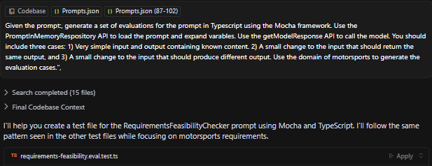

# PromptRepository

A framework for managing, testing, and evaluating Large Language Model (LLM) prompts. Built to help you create more reliable and robust AI applications through systematic prompt engineering, validation, and testing.

The repo also demonstrates a technique I think will become much more common - bundling a framework with prompts to generate code to use the framework.

Inspired by two main things:
- [Anthropic's guidance on writing applications](https://www.anthropic.com/engineering/building-effective-agents) - which is in essence, 'keep it simple'. Use the basic API for as long as it works, and don't leap straight to heavy frameworks like LangChain, Rivet etc. "We suggest that developers start by using LLM APIs directly: many patterns can be implemented in a few lines of code.". The frameworks are great, but can divert you into learning the framework rather than learning more directly about how to productively use the LLM. 
- [Chris Benson/Practical AI's work](https://practicalai.fm/295) on the equivalent of Unit Tests for Prompts. This gives you a solid base to build from as you build apps which contain many embeded prompts & target responses for which you need to assure quality.

## Externalized Prompts - stored in JSON

- The motivation is to easily allow your prompts to be separated from your code, so you can define a distinct lifecycle e.g. testing a prompt variant when you change the model is not the same as re-testing your code. It is a subset. (You do need to retest the whole thing at the end though...)
- Simple JSON schema for prompts, initially for TypeScript but allowing portability for a Python client in future.
- Prompts can be loaded from JSON files at runtime or included as TypeScript variables at build time.

The Prompt format includes:
- an ID and version for tracking changes
- user and system prompt values
- required and optional parameters
- default values for optional parameters
- automatic validation of required parameters during template expansion

The format is compatible with [Model Context Protocol (MCP)](https://modelcontextprotocol.io/), which I envisage using as soon as Cursor adds support for Prompts. 

## Packaged prompts for generating Evals for your prompts

- Standard prompts for generating unit tests (mainly presence of required parameters and permutations of optional ones) and unit evals for your prompts.
- Unit testing is pretty standard, but Evals are quite new thinking. For a given prompt in your application, the 'generateEvals' prompt creates three evals:
   - A base function eval. The simplest thing you can ask your model, and what you expect must be in the response.
   - Amended input to the base function that provides the same output.
   - Amended input to the base function that should provide different output.

These are all very basic tests - you expect them to work 100% of the time, like unit tests, so you run them as frequently as you run unit tests whenever you change your prompts.

This approach has been described by Chris Benson, an AI Strategist for Lockheed Martin, in the [Practical AI Podcast](https://practicalai.fm/295). It's about 40 minutes in.

Example:
```code
PROMPT = "Given some text, classify it as POSITIVE or NEGATIVE"

# Base Test (simplest possible test, must pass)
TEST basic_sentiment:
    INPUT = "I am happy"
    RESULT = evaluate(INPUT)
    EXPECT RESULT = POSITIVE

# Same Result Test (different input, same expected output)
TEST similar_sentiment:
    INPUT = "I am joyful"
    RESULT = evaluate(INPUT)
    EXPECT RESULT = POSITIVE

# Different Result Test (different input, different output)
TEST opposite_sentiment:
    INPUT = "I am sad"
    RESULT = evaluate(INPUT)
    EXPECT RESULT = NEGATIVE
``` 

The Eval prompt:
```code
Given the following prompt: <prompt>{prompt}</prompt>, generate a set of evaluations for the prompt in
{language} using the {framework} framework. Use the PromptInMemoryRespository API to load the prompt and
expand varables. Use the getModelResponse API to call the model. You should include three cases:
1) Very simple input and output containing known content.
2) A small change to the input that should return the same output.
3) A small change to the input that should produce different output.
Use the domain of motorsports to generate the evaluation cases.
``` 

The Test prompt:
```code
Given the following prompt: <prompt>{prompt}</prompt>, generate a full set of unit tests for the prompt in
{language} using the {framework} framework. Cover all permmutations of missing required parameters, and
variant values for both required and optional parameters.
``` 

This approach (bundling a framework with prompts to generate code to use the framework) is still work in progress. I am using the prompts to generate test cases for another LLM-based application I am building, and will continue to evolve the prompts. 

## Usage - Prompt Respository

1. Install the package:

```bash
npm install /path/to/PromptRepository/
``` 

Ensure you have set your OpenAI API key as an environment variable: OPENAI_API_KEY


2. Create a JSON file containing your prompts

```json
[{
  "id": "template-prompt-001",
  "version": "1.0.0",
  "name": "Template Prompt",
  "systemPrompt": "You are a helpful assistant that {ROLE_DESCRIPTION}. Your task is to {TASK_DESCRIPTION}.",
  "systemPromptParameters": [
    {
      "name": "ROLE_DESCRIPTION",
      "description": "Description of the assistant's role",
      "type": "kString",
      "required": true
    },
    {
      "name": "TASK_DESCRIPTION",
      "description": "Description of the main task or objective",
      "type": "kString",
      "required": true
    }
  ],
  "userPrompt": "Please help me with {USER_REQUEST}. Consider the following context: {CONTEXT}",
  "userPromptsParameters": [
    {
      "name": "USER_REQUEST",
      "description": "The specific request or question from the user",
      "type": "kString",
      "required": true
    },
    {
      "name": "CONTEXT",
      "description": "Additional context or background information",
      "type": "kString",
      "required": false
    }
  ]
}]
``` 

3. Use the prompts in your TypeScript project:

```typescript
import { PromptFileRepository} from "PromptRepository";

const fileName = "template-prompt.json";
const filePath = path.join(__dirname, fileName);

// Initialize repository with test file
const repo = new PromptFileRepository(filePath);

const promptId1 = "template-prompt-001";

// Test loading a specific prompt
const prompt : IPrompt | undefined = await repo.getPrompt(promptId1);
expect(prompt).toBeDefined();

let result = repo.expandSystemPrompt(prompt, {ROLE_DESCRIPTION: "Teaches French", TASK_DESCRIPTION: "Teach the user how to say 'Hello' in French"});
expect(result).toContain("Teaches French");
expect(result).toContain("Teach the user how to say 'Hello' in French");

let result2 = repo.expandUserPrompt(prompt, {USER_REQUEST: "How do I say 'Hello' in French?", CONTEXT: "The user is a beginner to French"});
expect(result2).toContain("How do I say 'Hello' in French?");
expect(result2).toContain("The user is a beginner to French");
``` 

## Usage - Eval Prompts

for Cursor users:
- Select your prompt and add it to the context.
- Add your codebase to the context.
- Cut and Paste the prompt. When Cursor supports MCP prompts I envisage moving the prompt to a tool. 

You should see something like this: 
- 

Run the prompt & Cursor should generate a decent set of Unit-test level Evals for you. 

## Contributing

Contributions are welcome! Please feel free to submit a Pull Request.

1. Fork the repository
2. Create your feature branch (`git checkout -b feature/AmazingFeature`)
3. Commit your changes (`git commit -m 'Add some AmazingFeature'`)
4. Push to the branch (`git push origin feature/AmazingFeature`)
5. Open a Pull Request against the development branch in the main repo. 

Copyright (c) 2025 Jon Verrier


