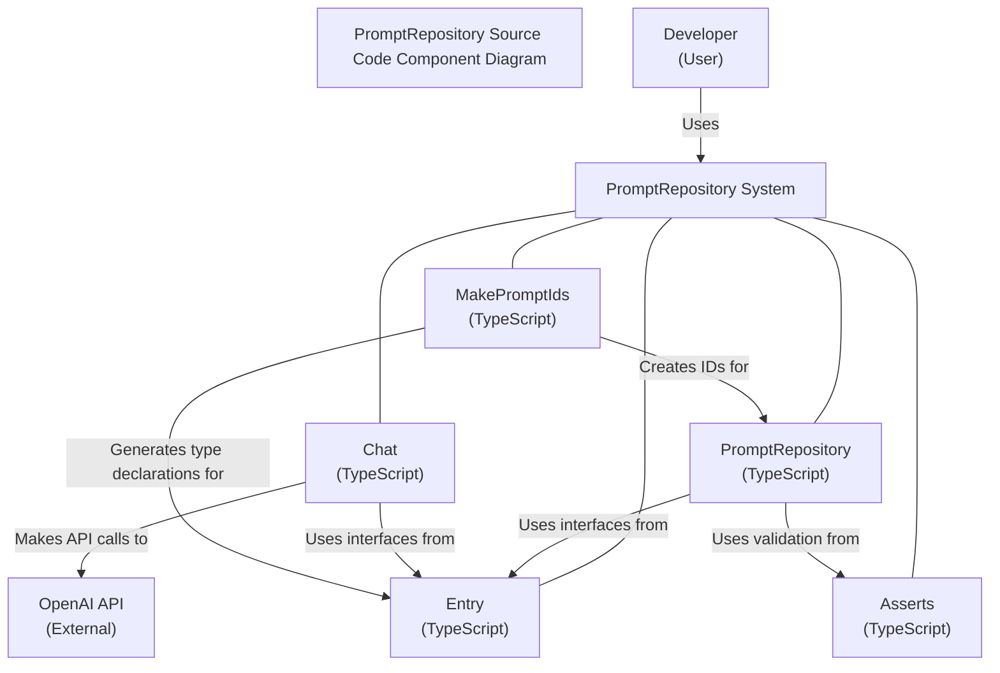

```mermaid
flowchart TD
    title[PromptRepository Source Code Component Diagram]
    
    developer["Developer<br>(User)"]
    promptRepo["PromptRepository System"]
    promptRepository["PromptRepository<br>(TypeScript)"]
    chat["Chat<br>(TypeScript)"]
    entry["Entry<br>(TypeScript)"]
    asserts["Asserts<br>(TypeScript)"]
    makePromptIds["MakePromptIds<br>(TypeScript)"]
    openai["OpenAI API<br>(External)"]
    
    developer -->|Uses| promptRepo
    promptRepo --- promptRepository
    promptRepo --- chat
    promptRepo --- entry
    promptRepo --- asserts
    promptRepo --- makePromptIds
    chat -->|Makes API calls to| openai
    promptRepository -->|Uses interfaces from| entry
    promptRepository -->|Uses validation from| asserts
    chat -->|Uses interfaces from| entry
    makePromptIds -->|Generates type declarations for| entry
    makePromptIds -->|Creates IDs for| promptRepository
```