<!-- Generated by StrongAIAutoDoc 20260219 -->

This directory implements a provider-agnostic AI interaction layer for chat, attachments, and embeddings. Core abstractions in entry.ts and Chat.ts define models, providers, roles, verbosity, and driver contracts. Concrete chat drivers integrate OpenAI, Azure OpenAI, and Google Gemini, with a Generic OpenAI base that unifies OpenAI-compatible flows, tool-calling, streaming, retries, and constrained JSON. Parallel “with attachment” drivers add file and table JSON support using Responses/Files or inline data. Embedding drivers share a base helper with cosine similarity and robust retry logic, selecting provider-specific clients. Factories create drivers by provider and environment, while utilities cover retries, prompt repositories, function/type definitions, and message formatting.

```mermaid
C4Component
title AI Abstraction Layer - Components and Integrations

Person(app, "App/Caller", "Uses unified chat, attachment, and embedding APIs")
System_Ext(openaiApi, "OpenAI API", "Responses, Files, Embeddings")
System_Ext(azureApi, "Azure OpenAI", "Responses, Files, Embeddings")
System_Ext(geminiApi, "Google Gemini API", "Generative AI")

Container_Boundary(layer, "LLM Abstraction Layer (TypeScript)") {

  Component(entry, "entry.ts", "Types & Enums", "Core contracts: models, providers, roles, drivers, factories, utilities")
  Component(chatBase, "Chat.ts", "Base ChatDriver", "Provider-agnostic chat interface")
  Component(genericOpenAI, "Chat.GenericOpenAI.ts", "GenericOpenAIChatDriver", "OpenAI-compatible Responses flow, tools, streaming, retries")
  Component(chatOpenAI, "Chat.OpenAI.ts", "OpenAIChatDriver", "Configures OpenAI client/models")
  Component(chatAzure, "Chat.AzureOpenAI.ts", "AzureOpenAIChatDriver", "Configures Azure OpenAI client/deployments")
  Component(chatGemini, "Chat.GoogleGemini.ts", "GoogleGeminiChatDriver", "Gemini chat, streaming, tools, constrained JSON")
  Component(chatFactory, "ChatFactory.ts", "ChatDriverFactory", "Creates chat drivers by provider/env")

  Component(attBase, "ChatWithAttachment.ts", "Attachment Driver Contract", "Unified attachment and table JSON interface")
  Component(attOpenAI, "ChatWithAttachment.OpenAI.ts", "OpenAIChatWithAttachment", "Responses + Files; uploads/cleans up")
  Component(attAzure, "ChatWithAttachment.AzureOpenAI.ts", "AzureOpenAIChatWithAttachment", "Azure Responses + Files; uploads/cleanup")
  Component(attGemini, "ChatWithAttachment.GoogleGemini.ts", "GoogleGeminiChatWithAttachment", "Inline base64 attachments; flash model")
  Component(attFactory, "ChatWithAttachmentFactory.ts", "AttachmentDriverFactory", "Creates attachment-capable drivers")

  Component(embedBase, "Embed.ts", "OpenAIModelEmbeddingDriver + cosineSimilarity", "Shared embedding logic and math")
  Component(embedOpenAI, "Embed.OpenAI.ts", "NativeOpenAIEmbeddingDriver", "Direct OpenAI embeddings")
  Component(embedAzure, "Embed.AzureOpenAI.ts", "AzureOpenAIEmbeddingDriver", "Azure-hosted embeddings")
  Component(embedFactory, "EmbedFactory.ts", "EmbeddingDriverFactory", "Creates embedding drivers")

  Component(driverHelpers, "DriverHelpers.ts", "Retry/Backoff", "Exponential backoff, error normalization")
  Component(functionTypes, "Function.ts", "LLM Function Types", "Schemas, function call I/O contracts")
  Component(promptRepo, "PromptRepository.ts", "Prompt Stores", "File/in-memory prompt templates and expansion")
  Component(formatMsg, "FormatChatMessage.ts", "Formatting", "Human-readable message/timestamp formatting")
}

Rel(app, chatFactory, "Create IChatDriver")
Rel(app, attFactory, "Create IChatWithAttachmentDriver")
Rel(app, embedFactory, "Create IEmbeddingModelDriver")
Rel(app, promptRepo, "Lookup/expand prompts")
Rel(app, formatMsg, "Render chat lines")

Rel(chatFactory, chatOpenAI, "Instantiates")
Rel(chatFactory, chatAzure, "Instantiates")
Rel(chatFactory, chatGemini, "Instantiates")

Rel(chatOpenAI, genericOpenAI, "Extends/uses")
Rel(chatAzure, genericOpenAI, "Extends/uses")

Rel(chatOpenAI, openaiApi, "Responses, tools")
Rel(chatAzure, azureApi, "Responses, tools")
Rel(chatGemini, geminiApi, "Generate content, tools")

Rel(chatGemini, chatBase, "Implements")
Rel(chatOpenAI, chatBase, "Implements")
Rel(chatAzure, chatBase, "Implements")
Rel(genericOpenAI, chatBase, "Extends")

Rel(genericOpenAI, driverHelpers, "Retries/backoff")
Rel(chatGemini, driverHelpers, "Retries/backoff")

Rel(genericOpenAI, functionTypes, "Tool schemas & calls")
Rel(chatGemini, functionTypes, "Tool schemas & calls")

Rel(attFactory, attOpenAI, "Instantiates")
Rel(attFactory, attAzure, "Instantiates")
Rel(attFactory, attGemini, "Instantiates")

Rel(attOpenAI, openaiApi, "Responses + Files")
Rel(attAzure, azureApi, "Responses + Files")
Rel(attGemini, geminiApi, "Inline media")

Rel(embedFactory, embedOpenAI, "Instantiates")
Rel(embedFactory, embedAzure, "Instantiates")
Rel(embedOpenAI, embedBase, "Extends/uses")
Rel(embedAzure, embedBase, "Extends/uses")
Rel(embedBase, driverHelpers, "Retries/backoff")
Rel(embedOpenAI, openaiApi, "Embeddings")
Rel(embedAzure, azureApi, "Embeddings")

Rel(entry, chatBase, "Types/contracts")
Rel(entry, genericOpenAI, "Types/contracts")
Rel(entry, attBase, "Types/contracts")
Rel(entry, embedBase, "Types/contracts")
Rel(entry, promptRepo, "Types/contracts")
Rel(entry, formatMsg, "Types/contracts")
```

Key components:
- entry.ts and Chat.ts define the foundational contracts that all drivers implement, ensuring consistent APIs across providers. Chat.GenericOpenAI centralizes OpenAI-compatible tooling (Responses, function-calling loops, streaming, constrained JSON, retries), which Chat.OpenAI and Chat.AzureOpenAI reuse by supplying provider-specific clients and model mappings. GoogleGeminiChatDriver independently mirrors those capabilities for Gemini’s API and constraints.
- ChatWithAttachment.* drivers add file handling: OpenAI/Azure use Responses + Files with optional cleanup, while Gemini uses inline base64 media. The Attachment and Chat factories encapsulate provider selection and environment-aware defaults.
- Embed.ts supplies a shared embedding driver with cosine similarity and resilient retry behavior, extended by NativeOpenAIEmbeddingDriver and AzureOpenAIEmbeddingDriver; EmbeddingDriverFactory returns the right implementation.
- DriverHelpers standardizes exponential backoff and error normalization. Function.ts formalizes tool schemas and I/O, enabling portable function calling. PromptRepository manages templated prompts, and FormatChatMessage provides consistent, readable message rendering.