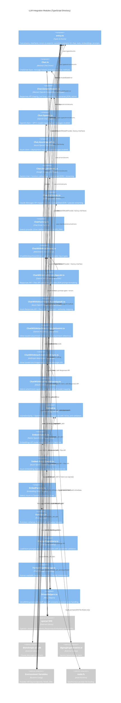

<!-- Generated by StrongAIAutoDoc 20260516 -->

This directory implements a provider-agnostic AI integration layer for chat, tool/function calling, attachments, embeddings, and prompt templating. It defines shared contracts and enums in `entry.ts`, then supplies base abstractions (`ChatDriver`, `GenericOpenAIChatDriver`, `OpenAIModelEmbeddingDriver`, `IChatWithAttachmentDriver`) that normalize message formats, retries, streaming, constrained JSON output, and error semantics. Provider-specific drivers for OpenAI, Azure OpenAI, Google Gemini, and Anthropic adapt those abstractions to each vendor SDK and environment configuration. Factories choose appropriate drivers by provider and runtime environment, while utilities format chat history and expand prompt templates for consistent, reusable prompting.

```mermaid
C4Component
title LLM Integration Modules (TypeScript Directory)

%% Shared contracts / types
Component(entry, "entry.ts", "Types & Enums", "Core enums, interfaces, errors re-exports; common contracts for chat, tools, embeddings, prompts.")

%% Chat (base + providers)
Component(chatBase, "Chat.ts", "Abstract Chat Driver", "ChatDriver base: message helpers and required chat methods.")
Component(chatGenericOpenAI, "Chat.GenericOpenAI.ts", "Abstract OpenAI-Compatible Chat Driver", "Responses API shaping, tool loop, streaming, constrained JSON, retries.")
Component(chatOpenAI, "Chat.OpenAI.ts", "OpenAI Chat Driver", "OpenAI client + GPT-5 model mapping; tool messages enabled.")
Component(chatAzure, "Chat.AzureOpenAI.ts", "Azure OpenAI Chat Driver", "Azure client + deployment mapping; tool messages enabled.")
Component(chatGemini, "Chat.GoogleGemini.ts", "Google Gemini Chat Driver", "Gemini chat + function calling loop + constrained JSON + streaming.")
Component(chatAnthropic, "Chat.Anthropic.ts", "Anthropic Chat Driver", "Claude Messages API mapping + tools + constrained JSON + pseudo-streaming.")
Component(chatFactory, "ChatFactory.ts", "Chat Driver Factory", "Selects provider driver (default based on NODE_ENV).")

%% Attachments (base + providers)
Component(chatAttachBase, "ChatWithAttachment.ts", "Attachment Chat Contract", "IChatWithAttachmentDriver + attachment/table input types.")
Component(chatAttachOpenAI, "ChatWithAttachment.OpenAI.ts", "OpenAI Attachment Chat Driver", "Responses API + Files API upload/delete; table JSON prompt formatting.")
Component(chatAttachAzure, "ChatWithAttachment.AzureOpenAI.ts", "Azure OpenAI Attachment Chat Driver", "Azure Responses API + Files API; deployment + verbosity mapping.")
Component(chatAttachGemini, "ChatWithAttachment.GoogleGemini.ts", "Gemini Attachment Chat Driver", "Inline base64 attachment via Gemini; no attachment references.")
Component(chatAttachAnthropic, "ChatWithAttachment.Anthropic.ts", "Anthropic Attachment Chat Driver", "Inline base64 doc/image/text in Claude Messages API.")
Component(chatAttachFactory, "ChatWithAttachmentFactory.ts", "Attachment Driver Factory", "Selects attachment-capable driver and default model mapping.")

%% Embeddings
Component(embedBase, "Embed.ts", "Embedding Utilities", "cosineSimilarity + OpenAIModelEmbeddingDriver with retries and validation.")
Component(embedOpenAI, "Embed.OpenAI.ts", "Native OpenAI Embedding Driver", "Embeddings API model selection; OpenAI client init.")
Component(embedAzure, "Embed.AzureOpenAI.ts", "Azure OpenAI Embedding Driver", "Azure embedding deployment mapping; Azure client init.")
Component(embedFactory, "EmbedFactory.ts", "Embedding Driver Factory", "Selects Azure vs OpenAI embedding driver.")

%% Tool calling schema/types
Component(fnTypes, "Function.ts", "Tooling Types", "IFunction, schemas, function call and output shapes.")

%% Prompting + formatting + retries
Component(promptRepo, "PromptRepository.ts", "Prompt Repository", "Load/store prompts and expand templates with parameter validation.")
Component(formatChat, "FormatChatMessage.ts", "Chat Message Formatting", "Human-readable message rendering + friendly timestamps.")
Component(driverHelpers, "DriverHelpers.ts", "Retry Helpers", "retryWithExponentialBackoff, backoff constants; transient error handling.")

%% External SDKs / systems
Component_Ext(openaiSdk, "openai SDK", "External Library", "OpenAI + AzureOpenAI clients (Responses/Embeddings/Files APIs).")
Component_Ext(anthropicSdk, "@anthropic-ai/sdk", "External Library", "Claude Messages API client.")
Component_Ext(geminiSdk, "@google/generative-ai", "External Library", "Gemini Generative AI client.")
Component_Ext(env, "Environment Variables", "Runtime Config", "Provider API keys/endpoints; NODE_ENV.")
Component_Ext(fs, "node:fs", "Node Runtime", "Synchronous prompt file loading.")

%% Relationships: shared dependencies
Rel(chatBase, entry, "uses types/enums")
Rel(chatGenericOpenAI, chatBase, "extends")
Rel(chatGenericOpenAI, entry, "uses types/errors/enums")
Rel(chatGenericOpenAI, driverHelpers, "uses retries")
Rel(chatGenericOpenAI, fnTypes, "uses tool schemas/types")

Rel(chatOpenAI, chatGenericOpenAI, "extends")
Rel(chatOpenAI, openaiSdk, "creates client; calls Responses API")
Rel(chatOpenAI, env, "reads OPENAI_API_KEY")
Rel(chatOpenAI, entry, "throws InvalidStateError")

Rel(chatAzure, chatGenericOpenAI, "extends")
Rel(chatAzure, openaiSdk, "creates AzureOpenAI client; calls Responses API")
Rel(chatAzure, env, "reads AZURE_OPENAI_API_KEY/ENDPOINT")
Rel(chatAzure, entry, "throws InvalidStateError")

Rel(chatGemini, chatBase, "implements")
Rel(chatGemini, geminiSdk, "calls Gemini API")
Rel(chatGemini, env, "reads GOOGLE_GEMINI_API_KEY")
Rel(chatGemini, driverHelpers, "uses retries")
Rel(chatGemini, fnTypes, "executes IFunction tools")
Rel(chatGemini, entry, "uses types/errors/enums")

Rel(chatAnthropic, chatBase, "implements")
Rel(chatAnthropic, anthropicSdk, "calls Claude Messages API")
Rel(chatAnthropic, env, "reads ANTHROPIC_API_KEY")
Rel(chatAnthropic, driverHelpers, "uses retries")
Rel(chatAnthropic, fnTypes, "supports tool calling")
Rel(chatAnthropic, entry, "uses types/errors/enums")

Rel(chatFactory, entry, "uses EModel/EModelProvider, factory interfaces")
Rel(chatFactory, chatOpenAI, "creates")
Rel(chatFactory, chatAzure, "creates")
Rel(chatFactory, chatGemini, "creates")
Rel(chatFactory, chatAnthropic, "creates")
Rel(chatFactory, env, "uses NODE_ENV for defaults")

%% Attachments relationships
Rel(chatAttachBase, entry, "uses EVerbosity")
Rel(chatAttachOpenAI, chatAttachBase, "implements")
Rel(chatAttachOpenAI, openaiSdk, "Responses API + Files API")
Rel(chatAttachOpenAI, env, "reads OPENAI_API_KEY (if client not injected)")
Rel(chatAttachOpenAI, entry, "uses errors/enums")

Rel(chatAttachAzure, chatAttachBase, "implements")
Rel(chatAttachAzure, openaiSdk, "Azure Responses API + Files API")
Rel(chatAttachAzure, env, "reads AZURE_OPENAI_API_KEY/ENDPOINT")
Rel(chatAttachAzure, entry, "uses errors/enums")

Rel(chatAttachGemini, chatAttachBase, "implements")
Rel(chatAttachGemini, geminiSdk, "generateContent with inlineData")
Rel(chatAttachGemini, env, "reads GOOGLE_GEMINI_API_KEY")
Rel(chatAttachGemini, driverHelpers, "uses retries")
Rel(chatAttachGemini, entry, "uses errors/enums")

Rel(chatAttachAnthropic, chatAttachBase, "implements")
Rel(chatAttachAnthropic, anthropicSdk, "Messages API with inline docs/images")
Rel(chatAttachAnthropic, env, "reads ANTHROPIC_API_KEY")
Rel(chatAttachAnthropic, driverHelpers, "uses retries")
Rel(chatAttachAnthropic, entry, "uses errors/enums")

Rel(chatAttachFactory, entry, "uses EModel/EModelProvider, factory interfaces")
Rel(chatAttachFactory, chatAttachOpenAI, "creates")
Rel(chatAttachFactory, chatAttachAzure, "creates")
Rel(chatAttachFactory, chatAttachGemini, "creates")
Rel(chatAttachFactory, chatAttachAnthropic, "creates")
Rel(chatAttachFactory, env, "uses NODE_ENV for defaults")

%% Embeddings relationships
Rel(embedBase, entry, "uses interfaces/enums/errors")
Rel(embedBase, driverHelpers, "uses retries")
Rel(embedOpenAI, embedBase, "extends")
Rel(embedOpenAI, openaiSdk, "calls Embeddings API")
Rel(embedOpenAI, env, "reads OPENAI_API_KEY")
Rel(embedAzure, embedBase, "extends")
Rel(embedAzure, openaiSdk, "calls Azure Embeddings API")
Rel(embedAzure, env, "reads AZURE_OPENAI_API_KEY/ENDPOINT")
Rel(embedFactory, entry, "uses EModel/EModelProvider + factory interface")
Rel(embedFactory, embedOpenAI, "creates")
Rel(embedFactory, embedAzure, "creates")

%% Prompting and formatting
Rel(promptRepo, entry, "uses prompt types + errors")
Rel(promptRepo, fs, "loads prompt JSON file (Node-only)")
Rel(formatChat, entry, "uses IChatMessage/EChatRole")
```

### Key components
`entry.ts` is the shared contract hub: enums (model/provider/roles/verbosity) and interfaces for chat, embeddings, prompts, and factories. `Chat.ts` provides the provider-agnostic `ChatDriver` base and message utilities, while `Chat.GenericOpenAI.ts` concentrates OpenAI-compatible behavior (Responses API config, tool loops, streaming modes, constrained JSON, and error handling). Provider drivers (`Chat.OpenAI.ts`, `Chat.AzureOpenAI.ts`, `Chat.GoogleGemini.ts`, `Chat.Anthropic.ts`) adapt those abstractions to each vendor SDK and environment configuration checks. `ChatFactory.ts` centralizes provider selection, including a NODE_ENV-based default. For multimodal/file workflows, `ChatWithAttachment.ts` defines the attachment/table contract and provider implementations handle inline vs uploaded files; `ChatWithAttachmentFactory.ts` selects them. Embeddings follow the same pattern via `Embed.ts`, provider drivers, and `EmbedFactory.ts`. `DriverHelpers.ts` standardizes retry/backoff and transient error classification across drivers.