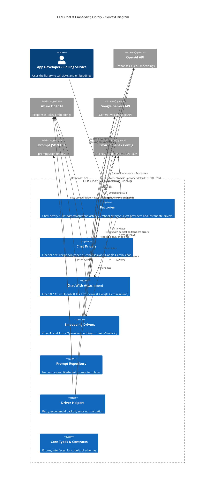

<!-- Generated by StrongAIAutoDoc 20260219 -->

This library provides a provider-agnostic chat and embedding layer for applications that need LLM interactions. It exposes unified drivers, factories, and prompt utilities so callers can generate text, stream responses, invoke tools/functions, enforce JSON schemas, and compute embeddings. The system dynamically routes to OpenAI, Azure OpenAI, or Google Gemini based on configuration and environment. It also supports attachments (inline or provider-hosted files) and simple prompt repositories, including JSON-backed templates. External dependencies include LLM provider APIs (Responses/Generative, Files, Embeddings), local prompt JSON files, and environment variables for API keys, endpoints, and provider defaults.

Key components and external interactions:
- Factories centralize provider selection. They choose OpenAI, Azure OpenAI, or Gemini using requested provider and NODE_ENV, returning the appropriate chat, attachment-capable, or embedding driver.
- Chat Drivers unify non-streaming, streaming, tool-calling, and schema-constrained responses. OpenAI and Azure use the Responses API; Gemini uses its Generative Language API with function-calling loops and forced-tools emulation.
- Chat With Attachment Drivers handle inline files or provider file references. OpenAI/Azure use Files + Responses; Gemini embeds base64 data inline. Optional deletion cleans up uploaded files.
- Embedding Drivers call OpenAI or Azure Embeddings and expose cosine similarity.
- Prompt Repository loads/expands templates from in-memory or prompts.json, validating parameters.
- Driver Helpers implement resilient retries, exponential backoff, and error normalization across all provider calls, improving reliability under rate limits and transient failures.