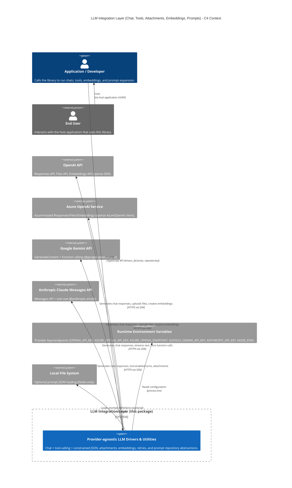

<!-- Generated by StrongAIAutoDoc 20260516 -->

This TypeScript package provides a provider-agnostic integration layer for LLM chat, tool/function calling, JSON-constrained outputs, embeddings, and prompt templating. It exposes consistent driver interfaces and factories so an application can switch between OpenAI, Azure OpenAI, Google Gemini, and Anthropic with minimal code changes. The system interacts with application developers (or a host app) that supply prompts, chat history, tools, and optional attachments. It depends on external LLM provider APIs for text generation and embeddings, plus local configuration via environment variables and, optionally, prompt files read from disk.

```mermaid
C4Context
title LLM Integration Layer (Chat, Tools, Attachments, Embeddings, Prompts) - C4 Context

Person(appDev, "Application / Developer", "Calls the library to run chats, tools, embeddings, and prompt expansion.")
Person_Ext(endUser, "End User", "Interacts with the host application that uses this library.")

System_Boundary(s1, "LLM Integration Layer (this package)") {
  System(core, "Provider-agnostic LLM Drivers & Utilities", "Chat + tool-calling + constrained JSON, attachments, embeddings, retries, and prompt repository abstractions.")
}

System_Ext(openai, "OpenAI API", "Responses API, Files API, Embeddings API (openai SDK).")
System_Ext(azureOpenai, "Azure OpenAI Service", "Azure-hosted Responses/Files/Embeddings (openai AzureOpenAI client).")
System_Ext(gemini, "Google Gemini API", "GenerateContent + function calling (@google/generative-ai).")
System_Ext(anthropic, "Anthropic Claude Messages API", "Messages API + tool use (@anthropic-ai/sdk).")
System_Ext(env, "Runtime Environment Variables", "Provider keys/endpoints (OPENAI_API_KEY, AZURE_OPENAI_API_KEY, AZURE_OPENAI_ENDPOINT, GOOGLE_GEMINI_API_KEY, ANTHROPIC_API_KEY, NODE_ENV).")
System_Ext(fs, "Local File System", "Optional prompt JSON loading (Node-only).")

Rel(endUser, appDev, "Uses", "via host application UI/API")
Rel(appDev, core, "Invokes", "TypeScript API (drivers, factories, repositories)")
Rel(core, openai, "Generates chat responses, uploads files, creates embeddings", "HTTPS via SDK")
Rel(core, azureOpenai, "Generates chat responses, uploads files, creates embeddings", "HTTPS via SDK")
Rel(core, gemini, "Generates chat responses, streams text, runs function calls", "HTTPS via SDK")
Rel(core, anthropic, "Generates chat responses, tool-enabled turns, attachments", "HTTPS via SDK")
Rel(core, env, "Reads configuration", "process.env")
Rel(core, fs, "Loads prompt definitions (optional)", "node:fs")
```

## Key components and external interactions
The primary boundary is a provider-agnostic driver layer that standardizes chat turns, streaming, tool/function calling loops, and JSON-schema-constrained outputs. Factories (ChatDriverFactory, ChatWithAttachmentDriverFactory, EmbeddingDriverFactory) select concrete implementations by provider and model size, with defaults influenced by NODE_ENV (e.g., Gemini in development, OpenAI in production). External LLM dependencies are OpenAI (Responses/Files/Embeddings), Azure OpenAI (deployment-mapped Responses/Files/Embeddings), Google Gemini (generateContent with functionCalls and inline base64 attachments), and Anthropic (Messages API with tool use and inline documents/images). Reliability is improved through shared exponential backoff retries that treat rate limits and transient 5xx errors as retryable. PromptRepository supports in-memory prompts or JSON-file loading from the local filesystem, while configuration is supplied via environment variables for API keys and endpoints.