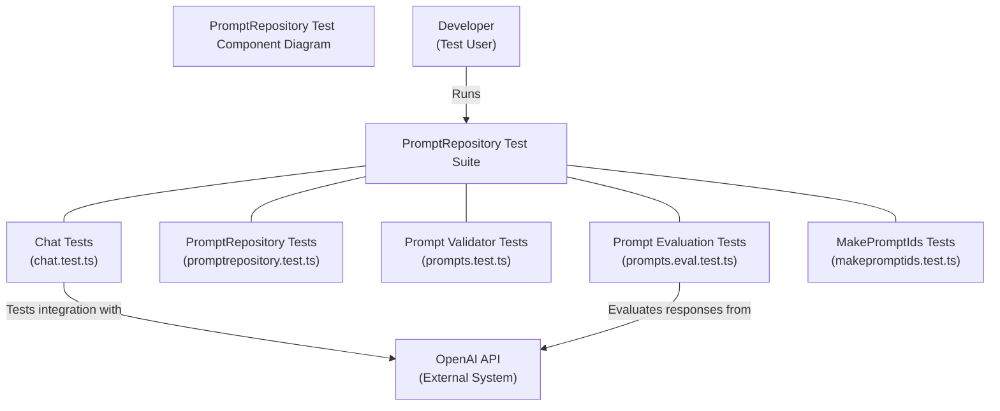

```mermaid
flowchart TD
    title[PromptRepository Test Component Diagram]
    
    developer["Developer<br>(Test User)"]
    testSuite["PromptRepository Test Suite"]
    chatTest["Chat Tests<br>(chat.test.ts)"]
    promptRepoTest["PromptRepository Tests<br>(promptrepository.test.ts)"]
    promptsTest["Prompt Validator Tests<br>(prompts.test.ts)"]
    promptsEvalTest["Prompt Evaluation Tests<br>(prompts.eval.test.ts)"]
    makePromptIdsTest["MakePromptIds Tests<br>(makepromptids.test.ts)"]
    
    openaiAPI["OpenAI API<br>(External System)"]
    
    developer -->|Runs| testSuite
    testSuite --- chatTest
    testSuite --- promptRepoTest
    testSuite --- promptsTest
    testSuite --- promptsEvalTest
    testSuite --- makePromptIdsTest
    
    chatTest -->|Tests integration with| openaiAPI
    promptsEvalTest -->|Evaluates responses from| openaiAPI
```